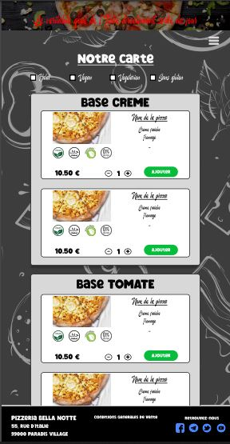
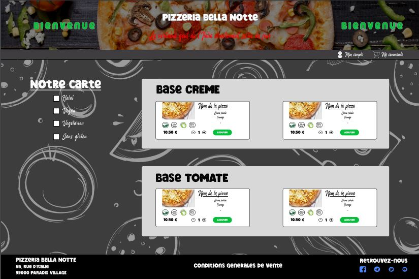
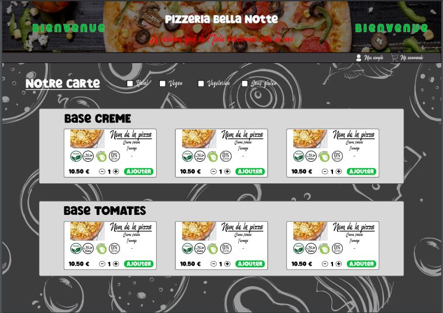
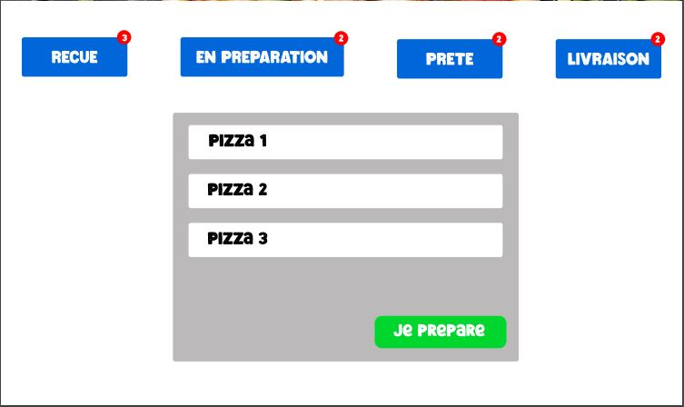

# Projet ECF Back-End

## Description
Ce projet est un Back-End développé dans le cadre de mon ECF (Examen en Cours de Formation) de Développeur Web et Web Mobile Full-stack.\
Il implémente une architecture MVC et est conçu pour gérer la commande de pizzas ainsi que la création et la gestion des clients.\
Ce projet fait suite à mon ECF Front-End démontrant mes compétences en HTML, CSS, JavaScript.\
Le projet ECF Back-end quand à lui permet de démontrer mes compétences en PHP et SQL.

Le but du projet est de créer une application web pour une pizzeria permettant la gestion des commandes en ligne, avec des interfaces distinctes pour les clients et le personnel.

## Technologies utilisées

- **Looping** : Représentation visuelle de l'architecture de la base de données
- **PHP** : Language de programmation permettant d'effectuer des requêtes vers la base de données SQL.
- **SQL** : Base de données.

## Fonctionnalités

- L'application permet de passer une commande dans une pizzeria, de valider la commande après avoir crée un compte et s'être authentifié.
    - Interface utilisateur responsive et accessible sur tous les appareils.
    - Création et gestion d'utilisateurs.
    - Formulaires de saisie avec validation en temps réel.
    - Animations de l'interface client.
    - Intégration avec une base de données SQL.

## Représentation MCD/MLD/MPD

### Modèle Conceptuel de Données (MCD)


### Modèle Logique de Données (MLD)


### Modèle Physique de Données (MPD)




## Structure du projet

Voici la structure du projet :
```bash
/ECF-Back│
  ├── controller/
  │    ├── HomeController.php # Controller PHP gérant la homePage
  │    ├── LoginController.php # Controller PHP gérant les connexions
  │    ├── LogoutController.php # Controller PHP gérant les déconnexions
  │    ├── PizzaController.php # Controller PHP gérant la récupération des pizzas dans la BDD
  │    ├── RegisterController.php # Controller PHP gérant l'inscriptions des utilisateurs
  │    └── UserController # Controller PHP gérant les informations des utilisateurs
  ├── css/ 
  │    ├── animations.css # Fichier CSS pour les animations
  │    ├── cuisine.css # Fichier CSS pour le style de la page cuisine
  │    └── index.css # Fichier CSS pour le style de la page client
  ├── font/ 
  │    ├── Chieezy Burger.ttf # Police pour les titres
  │    └── Marchlike.ttf # Police pour les sous-titres
  ├── img/
  │    ├── favicon/
  │    │      ├── cuisine.png # Icône pour la page cuisine
  │    │      └── favicon.png # Icône pour la page client
  │    ├── maquettage/ # Images des maquettes
  │    │      ├── desktop-client.jpg
  │    │      ├── desktop-cuisine.jpg
  │    │      ├── mobile-client.jpg
  │    │      ├── modale-commande.jpg
  │    │      ├── modale-renseignements.jpg
  │    │      └── tablette-client.jpg
  │    ├── pizza/ # Images des pizzas
  │    │      ├── 4fromages.jpg
  │    │      ├── chevre_miel.jpg
  │    │      ├── fermiere.jpg
  │    │      ├── fullvegan.jpg
  │    │      ├── marguerita.jpg
  │    │      ├── napolitaine.jpg
  │    │      ├── orientale.jpg
  │    │      ├── pepperoni.jpg
  │    │      ├── raclette.jpg
  │    │      ├── reine.jpg
  │    │      ├── savoyarde.jpg
  │    │      └── tikki-thai.jpg
  │    ├── regime_alimentaire/ # Logo des différents régimes alimentaires
  │    │      ├── halal.png
  │    │      ├── sans_gluten.png
  │    │      ├── vegane.png
  │    │      └── vegetarienne.png
  │    ├── social/ # Logo des différents reseaux sociaux
  │    │      ├── facebook.png
  │    │      ├── telegram.png
  │    │      ├── twitter.png
  │    │      └── youtube.png
  │    ├── background.jpg
  │    ├── cart.png
  │    ├── header.jpg
  │    ├── trash.png
  │    └── user.png
  ├── js/
  │    ├── app.js # Fichier JaveScript pour la page client
  │    └── cuisine.js # Fichier JavaScript pour la page cuisine
  ├── model/
  │    ├── LoginModel.php # Modèle PHP gérant la logique des connexions
  │    ├── PizzaModel.php # Modèle PHP gérant la logique de récupération des pizzas
  │    ├── RegisterModel.php # Modèle PHP gérant la logique des inscriptions
  │    └── UserModel.php # Modèle PHP gérant la logique des informations de l'utilisateur
  ├── view/
  │    ├── HomeView.php # Vue PHP gérant la homePage
  │    ├── Layout.php # Vue PHP qui sert de template général
  │    ├── LoginView.php # Vue PHP gérant la page Login
  │    └── RegisterView.php # Vue PHP gérant la page d'inscription
  ├── composer.json # Fichier JSON indiquant les versions des dépendances
  ├── composer.json # Fichier JSON indiquant les versions des dépendances
  ├── Database.php # Fichier PHP permettant la connexion à la Base de Données
  ├── index.php # Fichier PHP servant de routeur vers les différents Controller
  └── README.md # Ce fichier

  ```
## Installation

1. **Clonez ce repository**
   ```bash
   git clone https://github.com/ChristopheKihl/ECF-Back.git
   ```

2. **Installez les dépendances**
  ```bash
  cd [nom_du_dossier]
  composer require phpdotenv
  ```
Choisir :
```bash
  [0]vlucas/phpdotenv
  ```

3. **Configurez l'environnement**\
   Créez un fichier .env à la racine du projet et ajoutez les variables d'environnement nécessaires :
  ```bash
  BASE='nom_de_la_BDD'
  SERVER='adresse_vers_la_BDD'
  USER='nom_d'utilisateur_connexion_bdd
  PASSWD='mot_de_passe_connexion_bdd
```

## Auteur

[KIHL Christophe](https://github.com/ChristopheKihl/)  
Développeur Full-Stack
